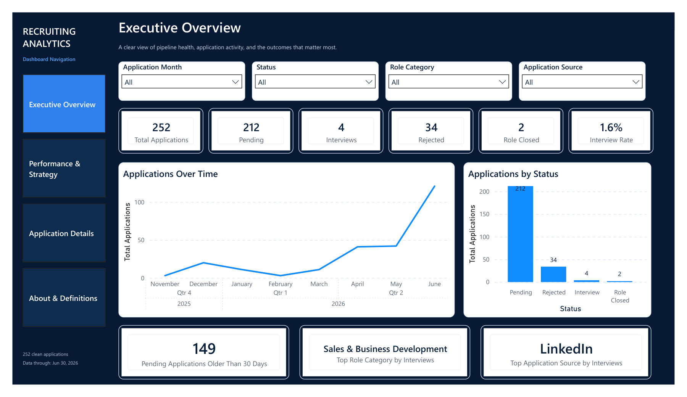
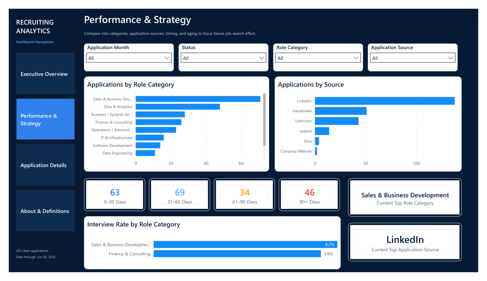
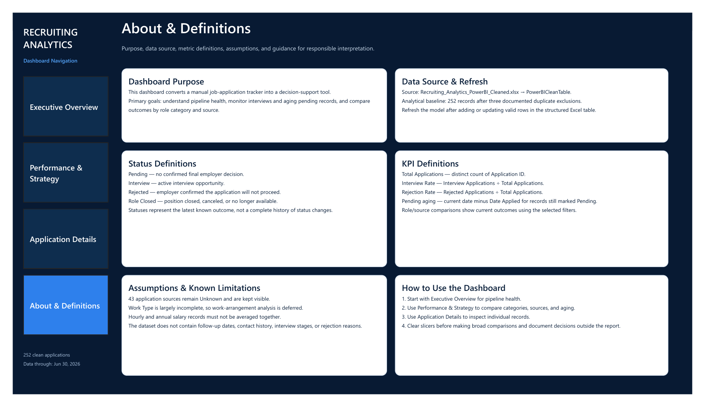

# Recruiting Analytics Dashboard

An end-to-end Power BI and business-analysis portfolio project that transforms a manually maintained job-application tracker into a four-page decision-support solution.



## Project deliverables

- [View the Power BI dashboard](docs/recruiting-analytics-dashboard.pdf)
- [Read the complete case study](docs/recruiting-analytics-case-study.pdf)
- [Review the methodology and limitations](docs/methodology-and-limitations.md)
- [Explore representative DAX measures](dax/measures.md)
- [Inspect the synthetic sample dataset](data/synthetic-sample.csv)

## Project overview

The original tracker supported record keeping, but it did not efficiently answer management-style questions about pipeline health, aging applications, source performance, role-category concentration, or active interview opportunities.

I designed and delivered a reporting solution that connects the full analysis lifecycle:

- stakeholder needs and business questions
- requirements and user stories
- data-quality assessment
- Power Query preparation
- DAX measures and KPI logic
- dashboard design and validation
- documentation, assumptions, and limitations

## My role

**Business Analyst / Power BI Developer / Project Manager**

## Tools

- Power BI
- Power Query
- DAX
- Excel
- Requirements documentation
- Process mapping
- Data-quality analysis

## Final analytical baseline

| Metric | Result |
|---|---:|
| Cleaned application records | 252 |
| Pending | 212 |
| Interviews | 4 |
| Rejected | 34 |
| Role closed | 2 |
| Interview rate | 1.6% |
| Pending older than 30 days | 149 |
| Data through | June 30, 2026 |

Three probable duplicate records were excluded from the analytical copy, leaving 252 cleaned records.

## Business problem

The manual tracker contained useful application records but made it difficult to:

- understand pipeline health quickly
- identify aging records that needed follow-up
- compare application effort across role categories and sources
- evaluate conversion quality instead of application volume alone
- inspect active interviews and record-level history consistently

## Solution

The finished dashboard contains four coordinated pages:

### 1. Executive Overview

Summarizes pipeline outcomes, application activity, status distribution, aging, and the strongest interview-producing segments.


### 2. Performance & Strategy

Compares application concentration by role category and source, separates pending records into aging bands, and compares interview rates across categories.



### 3. Application Details

Provides record-level views of active interviews and application history. The public repository does not include this page because it contains personal application records.

### 4. About & Definitions

Documents the report purpose, data source, refresh process, KPI definitions, status logic, assumptions, limitations, and usage guidance.



## Key findings

- 212 of 252 records were still marked **Pending**.
- The overall interview rate was **1.6%**.
- 149 pending applications were older than 30 days.
- LinkedIn was the leading interview source.
- Sales & Business Development was the top role category by interviews.
- Missing source values, incomplete work-type data, and limited follow-up tracking reduced the depth of analysis available.

## Data preparation

The Power BI model connected to a structured Excel table and applied preparation steps that included:

- excluding three probable duplicates
- standardizing dates, identifiers, salary fields, and categories
- preserving 43 unknown application-source values instead of inventing replacements
- rebuilding `Days Since Applied` with refresh-based date logic
- creating a month-start field for correct chronological reporting
- keeping hourly and annual salary records separate

## Representative DAX

Selected public examples are documented in [`dax/measures.md`](dax/measures.md).

## Repository contents

```text
recruiting-analytics-dashboard/
├── README.md
├── screenshots/
│   ├── executive-overview.png
│   ├── performance-strategy.png
│   └── about-definitions.png
├── docs/
│   ├── recruiting-analytics-dashboard.pdf
│   ├── recruiting-analytics-case-study.pdf
│   └── methodology-and-limitations.md
├── data/
│   └── synthetic-sample.csv
├── dax/
│   └── measures.md
├── release-assets/
│   └── README.md
├── PRIVACY.md
└── .gitignore
```

## Privacy and public-release decision

The original dataset contains personal job-search history. This repository intentionally excludes:

- the raw tracker
- the unsanitized Application Details page
- recruiter or contact information
- the original PBIX model containing record-level data

The public dashboard PDF and case study replace the original record-level Application Details view with a clearly labeled synthetic demonstration. The sample CSV is also synthetic and exists only to demonstrate the public schema.

## What this project demonstrates

- translating business questions into measurable requirements
- assessing and documenting data quality
- building repeatable Power Query transformations
- creating KPI logic with DAX
- designing an executive-to-operational reporting flow
- communicating assumptions and limitations responsibly
- packaging technical work for recruiter and stakeholder review

## Future enhancements

- add follow-up dates and contact history
- track interview stages and rejection reasons
- introduce a dedicated date table
- build a sanitized SQL/Python preparation pipeline
- publish a privacy-safe PBIX release
